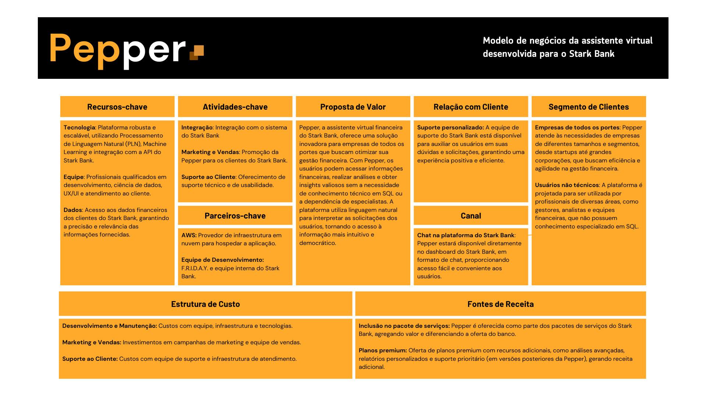
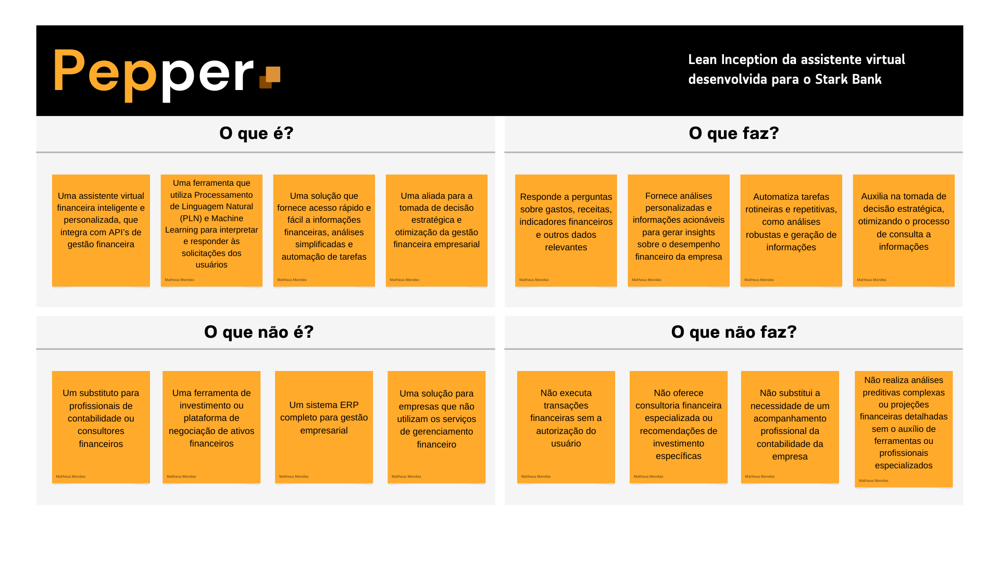
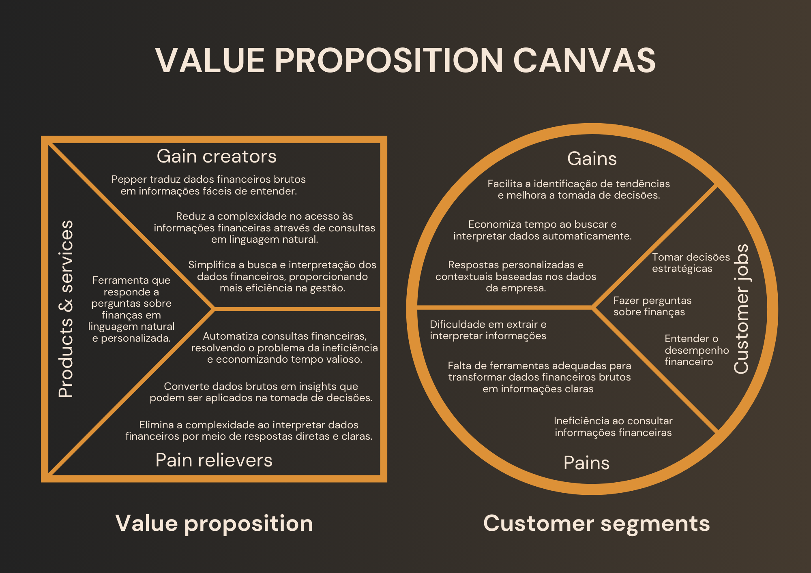

# Documentação Pepper

## Grupo - F.R.I.D.A.Y.

## Integrantes:
- <a href="https://www.linkedin.com/in/breno-santana-4a1912228/">Breno Santana</a>
- <a href="https://www.linkedin.com/in/laura-p-bueno/">Laura Bueno</a>
- <a href="https://www.linkedin.com/in/mateus-mar%C3%A7al/">Mateus Marçal</a>
- <a href="https://www.linkedin.com/in/matheusmeendes/">Matheus Mendes</a>
- <a href="https://www.linkedin.com/in/olincosta/">Ólin Medeiros</a>

## Sumário

[1. Introdução](#c1)

[2. Desenvolvimento e Análises de UX e Negócios](#c2)

[3. Análise e exploração dos dados](#c3)

[4. Desenvolvimento da Solução](#c4)

[5. Roadmap de Prospecção](#c5) 

[6. Referências](#c6)

 

# 1. Introdução

&emsp;&emsp;No cenário atual, onde a agilidade e a eficiência são de grande importância para o sucesso empresarial, a equipe F.R.I.D.A.Y. apresenta Pepper, a assistente virtual financeira projetada para transformar a maneira como as empresas interagem com suas finanças.

&emsp;&emsp;Com o objetivo de capacitar empresas de todos os portes, Pepper oferece acesso a informações financeiras personalizadas, consultas simplificadas em formato de texto, permitindo que os clientes tomem decisões mais estratégicas e otimizem seu tempo de busca.

&emsp;&emsp;Para escopo desse hackathon, integrando-se ao Web Banking do Stark Bank, Pepper proporciona uma experiência intuitiva e acessível, impulsionada por tecnologias de ponta como Processamento de Linguagem Natural (PLN) e Machine Learning. Através da combinação dessas ferramentas e da expertise da equipe F.R.I.D.A.Y., Pepper está pronta para revolucionar a gestão financeira empresarial, tornando-a mais eficiente, personalizada e estratégica.

&emsp;&emsp;Este documento detalhará a jornada de desenvolvimento da Pepper, desde a concepção até a implementação, explorando análises de negócios e UX, a arquitetura da solução, as tecnologias empregadas e os resultados alcançados. Além disso, serão discutidas as lições aprendidas e as perspectivas futuras para o aprimoramento contínuo da assistente virtual, consolidando o compromisso da Stark Bank em oferecer soluções inovadoras e centradas no cliente.

## 1.1 Objetivos

&emsp;&emsp;O projeto Pepper tem como objetivo central capacitar as empresas a consultar o gerenciamento das suas finanças de forma mais eficiente, estratégica e personalizada, através da implementação de uma assistente virtual financeira inovadora. Para alcançar esse objetivo, Pepper se propõe a fornecer acesso rápido e fácil a informações financeiras, promover a tomada de decisão informada, automatizar tarefas financeiras, personalizar a experiência do usuário, aprimorar a eficiência operacional, dentre outros.

## 1.2 Proposta da Solução

 
&emsp;&emsp;Para concretizar essa visão ambiciosa, Pepper será construída sobre uma arquitetura tecnológica robusta e escalável, utilizando serviços da AWS e frameworks Python como base. A solução combinará o poder do Processamento de Linguagem Natural (PLN) para interpretar as solicitações dos usuários com modelos de Machine Learning capazes de aprender e se adaptar continuamente, gerando querys SQL para requisições de dados e proporcionando respostas cada vez mais precisas e personalizadas. A integração, neste atual caso de uso com a API do Stark Bank garantirá acesso seguro e eficiente aos dados financeiros dos clientes, permitindo que Pepper forneça informações em tempo real e execute tarefas de forma automatizada.

## 1.3 Justificativa

 
&emsp;&emsp;A criação da assistente virtual financeira Pepper se justifica pela crescente necessidade das empresas de otimizar sua gestão financeira, tornando-a mais eficiente, estratégica e personalizada. Em um cenário cada vez mais competitivo e dinâmico, a capacidade de tomar decisões ágeis e embasadas em dados é fundamental para o sucesso empresarial. No entanto, muitas empresas ainda enfrentam desafios como dificuldade em acessar e interpretar informações financeiras de forma NoCode, processos manuais e demorados, falta de personalização, custos elevados, capacitação técnica, dentre outros.

 
&emsp;&emsp;Pepper surge como uma resposta a esses desafios, oferecendo uma solução acessível, eficiente e personalizada para a gestão financeira empresarial. Ao combinar o poder da inteligência artificial com a expertise de API's de Web Banking, como a do Stark Bank, a assistente virtual tem o potencial de democratizar o acesso a informações financeiras, tornando-as mais compreensíveis e acessíveis a todos os usuários, independentemente de seu conhecimento técnico.

 
&emsp;&emsp;Também possui o potencial de automatizar tarefas e otimizar processos, liberando tempo e recursos para que a equipe se concentre em atividades estratégicas e de maior valor agregado. Personalizar a experiência do usuário, oferecendo informações e análises adaptadas às necessidades e ao perfil de cada empresa. Reduzir custos e aumentar a eficiência, minimizando a necessidade de intervenção humana em tarefas rotineiras e otimizando a gestão financeira. Além de fortalecer o relacionamento com o cliente, oferecendo um serviço inovador e de alto valor agregado, que demonstra o compromisso de bancos, como a Stark Bank em apoiar o sucesso de seus clientes.

# 2. Desenvolvimento e Análises de UX e Negócios

## 2.1. Domínio de Fundamentos de Negócio

### 2.1.1. Lean Canvas

 
&emsp;&emsp;O modelo de negócios da Pepper, a assistente virtual financeira desenvolvida para o Stark Bank, visa revolucionar a gestão financeira empresarial ao democratizar o acesso à informação e análise de dados. A proposta de valor central da Pepper reside em sua capacidade de fornecer respostas rápidas e personalizadas a perguntas financeiras, gerar insights acionáveis e automatizar tarefas, tudo isso sem a necessidade de conhecimento técnico em SQL ou consulta de dados. A Pepper se integra perfeitamente ao ecossistema Stark Bank, oferecendo suporte personalizado e proativo aos clientes, impulsionando a tomada de decisões estratégicas e a eficiência operacional.

 
   Figura 2 - Modelo do Negócio   
   
   Fonte: Autoria Própria  

 
&emsp;&emsp;Em suma, o modelo de negócios da Pepper se destaca por sua proposta de valor centrada no cliente, combinando tecnologia de ponta, dados financeiros e expertise para oferecer uma solução completa e acessível para a gestão financeira empresarial. Ao democratizar o acesso à informação e análise de dados, a Pepper capacita empresas de todos os portes a tomarem decisões mais estratégicas e eficientes, impulsionando seu crescimento e sucesso. A integração com o Stark Bank, o foco em usuários não técnicos e o suporte personalizado garantem uma experiência superior, consolidando a posição da Pepper como uma ferramenta indispensável para a gestão financeira moderna.

### 2.1.2. Lean Inception

 
&emsp;&emsp;A Lean Inception da Pepper, a assistente virtual financeira desenvolvida para otimizar o gerenciamento financeiro, estabelece uma visão clara do que essa inovadora ferramenta representa e o que ela se propõe a realizar. Pepper é concebida como uma aliada inteligente e personalizada na gestão financeira empresarial, utilizando tecnologias de ponta, como os serviços da AWS para fornecer informações, análises e automação de tarefas, impulsionando a tomada de decisão estratégica. Ao mesmo tempo, a Lean Inception delimita o escopo da Pepper, esclarecendo o que ela não é e o que não faz, garantindo que as expectativas dos usuários estejam alinhadas com suas funcionalidades. Essa definição clara do propósito e dos limites da Pepper é essencial para orientar seu desenvolvimento e garantir que ela atenda às necessidades específicas dos clientes de bancos como o Stark Bank, impulsionando sua eficiência e sucesso financeiro.

 
   Figura 3 - Lean Inception Pepper   
   
   Fonte: Autoria Própria  

 

 
&emsp;&emsp;A Lean Inception da Pepper estabeleceu uma base sólida para o desenvolvimento da assistente virtual, definindo claramente seu propósito, funcionalidades e limites. A partir dessa visão, a equipe se dedicou a construir uma solução robusta e escalável, combinando tecnologias de ponta, como Processamento de Linguagem Natural e Machine Learning.

### 2.1.3. Value Proposition Canvas

 
&emsp;&emsp;O Value Proposition Canvas (VPC) é uma ferramenta estratégica usada para garantir que um produto ou serviço esteja alinhado com as necessidades e desejos do cliente, permitindo mapear detalhadamente os Customer Jobs, ou seja, as tarefas que os clientes precisam realizar, as Gains, que são os benefícios esperados, e as Pains, que são as dores ou frustrações enfrentadas. A partir disso, o VPC ajuda a criar soluções que maximizem os Gains e aliviem os Pains, por meio de Pain Relievers e Gain Creators claros e eficazes, que integram os Products & Services.

&emsp;&emsp;No contexto do projeto, o VPC é crucial para garantir que a solução desenvolvida, neste caso, a assistente virtual financeira Pepper, esteja ajustada para atender às principais demandas dos proprietários de PMEs. Com a análise estruturada do VPC, foi possível identificar que os clientes precisam de um acesso simplificado e rápido às informações financeiras e de ferramentas que transformem dados brutos em insights úteis. Ao mapear as dores e ganhos dos clientes, o projeto pode focar em criar uma experiência de valor, com respostas claras, automação de consultas e insights estratégicos.

 
   Figura 5 - Value Proposition Canvas   
   
   Fonte: Autoria Própria  

 
&emsp;&emsp;Em suma, o VPC é uma ferramenta essencial no desenvolvimento de qualquer solução orientada ao cliente, pois possibilita um entendimento profundo das necessidades e frustrações, o que, em última análise, garante que o produto entregue realmente agregue valor ao público-alvo. Para o projeto da Pepper, o uso do VPC permite que a assistente ofereça um serviço personalizado e eficiente, que resolve os principais problemas financeiros enfrentados por pequenas e médias empresas, gerando uma experiência positiva e produtiva.

### 2.1.4. Benchmark

 
&emsp;&emsp;

### 2.1.5. Análise financeira

 
&emsp;&emsp;

## 2.2 Entendimento da Experiência do Usuário

### 2.2.1 Personas

#### **Persona 1:** João, o dono de uma PME ( pequena e média empresa )

- **Idade:** 45 anos.

- **Profissão:** Dono de uma pequena / média empresa de varejo.

- **Responsabilidades:** Gestão financeira completa do negócio, incluindo toda a gestão do fluxo de caixa e do balanço patrimonial da empresa, trazendo as melhores recomendações para o CEO e embasando a sua tomada de decisão.

- **Papel:** Gerenciar o fluxo de caixa, otimizar despesas corporativas e garantir que a empresa tenha uma visão clara das suas finanças.

- **Dores:** Dificuldade em acessar dados específicos e personalizados de controle de caixa e saúde financeira da empresa. Pressão para reduzir custos financeiros, principalmente com a gestão de múltiplas contas empresariais e serviços bancários.

- **Caso de Uso 1:** Requisição de custos operacionais de vendas e marketing. João utiliza a Pepper para analisar os custos operacionais relacionados ao faturamento bruto da empresa.

- **Benefício:** Estas informações permitem que o João consiga analisar se os custos de vendas e marketing estão dando retorno para a empresa, auxiliando na tomada de decisão relacionada ao caixa orçamentário para a área de aquisição de clientes ( funil de vendas ).

- **Caso de Uso 2:** Análise Orçamentária Individual de Áreas. Através da Pepper, João consegue analisar os pedidos de compras dos diversos segmentos da empresa, atualizando os orçamentos destas áreas.

- **Benefício:** Auxilia no controle orçamentário das áreas da empresa separadamente e com espaços de tempo específicos, permitindo a análise mensal, semestral, anual, entre outros. 

#### **Persona 2:** Carla, a Gerente de Compras

- **Idade:** 32 anos.

- **Profissão:** Gerente de Compras de uma empresa de serviços.

- **Responsabilidades:** Gerencia as atividades de compras através de orçamentos, controle de custos e definição de parâmetros para novas aquisições, também faz fechamento de pedidos a fim de ter as melhores condições de preços, qualidade e prazo de entrega.

- **Papel:** Acompanhar e controlar as compras realizadas na empresa, sendo responsável por orçamento que beneficiarão a empresa.

- **Dores:** Dificuldade no acesso de informações relacionadas a transações de compras da organização de forma direta e intuitiva. Obstáculos envolvendo a análise de dados relacionados a gastos frequentes de reposição de estoque.

- **Caso de Uso 1:** Carla utiliza a Pepper para conseguir informações detalhadas sobre transações de compras da organização, visando receber estes dados de forma centralizada.

- **Benefício:** Ao utilizar a solução Carla consegue otimizar sua busca para categorias de compras específicas, adquirindo informações sobre custos de matérias primas para produção, por exemplo.

- **Caso de Uso 2:** Ao utilizar a Pepper, Carla consegue visualizar os gastos frequentes referente a reposição de estoque de forma simples através de uma interface amigável.

- **Benefício:** Direciona a análise de custos de forma clara, facilitando a interpretação de gastos e analisando o histórico de preço de seu fornecedor. Tal histórico possibilita que Carla analise se o fornecedor está dentro dos gastos direcionados à elaboração do produto comercializado.

### 2.2.2 User Stories

 
&emsp;&emsp;

### 2.2.3. Casos de uso

 
&emsp;&emsp;

# 3. Análise e exploração dos dados 

# 4. Desenvolvimento da Solução 

# 5. Roadmap de Prospecção 

# 6. Referências
