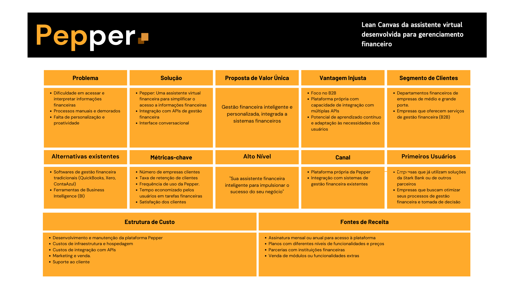

# Documentação Pepper

## Grupo - F.R.I.D.A.Y.

## Integrantes:
- <a href="https://www.linkedin.com/in/breno-santana-4a1912228/">Breno Santana</a>
- <a href="https://www.linkedin.com/in/laura-p-bueno/">Laura Bueno</a>
- <a href="https://www.linkedin.com/in/mateus-mar%C3%A7al/">Mateus Marçal</a>
- <a href="https://www.linkedin.com/in/matheusmeendes/">Matheus Mendes</a>
- <a href="https://www.linkedin.com/in/olincosta/">Ólin Medeiros</a>

## Sumário

[1. Introdução](#c1)

[2. Desenvolvimento e Análises de UX e Negócios](#c2)

[3. Análise e exploração dos dados](#c3)

[4. Desenvolvimento da Solução](#c4)

[5. Roadmap de Prospecção](#c5) 

[6. Referências](#c6)

 

# 1. Introdução

&emsp;&emsp;No cenário atual, onde a agilidade e a eficiência são de grande importância para o sucesso empresarial, a equipe F.R.I.D.A.Y. apresenta Pepper, a assistente virtual financeira projetada para transformar a maneira como as empresas interagem com suas finanças.

&emsp;&emsp;Com o objetivo de capacitar empresas de todos os portes, Pepper oferece acesso a informações financeiras personalizadas, consultas simplificadas em formato de texto, permitindo que os clientes tomem decisões mais estratégicas e otimizem seu tempo de busca.

&emsp;&emsp;Para escopo desse hackathon, integrando-se ao Web Banking do Stark Bank, Pepper proporciona uma experiência intuitiva e acessível, impulsionada por tecnologias de ponta como Processamento de Linguagem Natural (PLN) e Machine Learning. Através da combinação dessas ferramentas e da expertise da equipe F.R.I.D.A.Y., Pepper está pronta para revolucionar a gestão financeira empresarial, tornando-a mais eficiente, personalizada e estratégica.

&emsp;&emsp;Este documento detalhará a jornada de desenvolvimento da Pepper, desde a concepção até a implementação, explorando análises de negócios e UX, a arquitetura da solução, as tecnologias empregadas e os resultados alcançados. Além disso, serão discutidas as lições aprendidas e as perspectivas futuras para o aprimoramento contínuo da assistente virtual, consolidando o compromisso da Stark Bank em oferecer soluções inovadoras e centradas no cliente.

## 1.1 Objetivos

&emsp;&emsp;O projeto Pepper tem como objetivo central capacitar as empresas a consultar o gerenciamento das suas finanças de forma mais eficiente, estratégica e personalizada, através da implementação de uma assistente virtual financeira inovadora. Para alcançar esse objetivo, Pepper se propõe a fornecer acesso rápido e fácil a informações financeiras, promover a tomada de decisão informada, automatizar tarefas financeiras, personalizar a experiência do usuário, aprimorar a eficiência operacional, dentre outros.

## 1.2 Proposta da Solução

 
&emsp;&emsp;Para concretizar essa visão ambiciosa, Pepper será construída sobre uma arquitetura tecnológica robusta e escalável, utilizando serviços da AWS e frameworks Python como base. A solução combinará o poder do Processamento de Linguagem Natural (PLN) para interpretar as solicitações dos usuários com modelos de Machine Learning capazes de aprender e se adaptar continuamente, gerando querys SQL para requisições de dados e proporcionando respostas cada vez mais precisas e personalizadas. A integração, neste atual caso de uso com a API do Stark Bank garantirá acesso seguro e eficiente aos dados financeiros dos clientes, permitindo que Pepper forneça informações em tempo real e execute tarefas de forma automatizada.

## 1.3 Justificativa

 
&emsp;&emsp;A criação da assistente virtual financeira Pepper se justifica pela crescente necessidade das empresas de otimizar sua gestão financeira, tornando-a mais eficiente, estratégica e personalizada. Em um cenário cada vez mais competitivo e dinâmico, a capacidade de tomar decisões ágeis e embasadas em dados é fundamental para o sucesso empresarial. No entanto, muitas empresas ainda enfrentam desafios como dificuldade em acessar e interpretar informações financeiras de forma NoCode, processos manuais e demorados, falta de personalização, custos elevados, capacitação técnica, dentre outros.

 
&emsp;&emsp;Pepper surge como uma resposta a esses desafios, oferecendo uma solução acessível, eficiente e personalizada para a gestão financeira empresarial. Ao combinar o poder da inteligência artificial com a expertise de API's de gestão financeira, como soluções Web Banking, a assistente virtual tem o potencial de democratizar o acesso a informações financeiras, tornando-as mais compreensíveis e acessíveis a todos os usuários, independentemente de seu conhecimento técnico.

 
&emsp;&emsp;Também possui o potencial de automatizar consulta de informações e otimizar processos, liberando tempo e recursos para que a equipe se concentre em atividades estratégicas e de maior valor agregado. Personalizar a experiência do usuário, oferecendo informações  adaptadas às necessidades e ao perfil de cada empresa. Reduzir custos e aumentar a eficiência, minimizando a necessidade de intervenção humana em tarefas rotineiras e otimizando a gestão financeira. Além de fortalecer o relacionamento com o cliente, oferecendo um serviço inovador e de alto valor agregado, que demonstra o compromisso de bancos, como a Stark Bank em apoiar o sucesso de seus clientes.

# 2. Desenvolvimento e Análises de UX e Negócios

## 2.1. Domínio de Fundamentos de Negócio

### 2.1.1. Lean Canvas

 
&emsp;&emsp;No cenário empresarial atual, a gestão financeira eficiente e estratégica é fundamental para o sucesso. Diante dos desafios enfrentados por empresas na análise e interpretação de dados financeiros complexos, a equipe F.R.I.D.A.Y. apresenta a Pepper, uma assistente virtual financeira inovadora.

 
&emsp;&emsp;A Pepper combina o poder do Processamento de Linguagem Natural (PLN) e do Machine Learning para transformar a maneira como as empresas interagem com suas finanças. Com foco em empresas que oferecem serviços de gestão financeira, como a Stark Bank, a Pepper visa agregar valor a essas soluções, proporcionando uma experiência mais inteligente, personalizada e eficiente para seus clientes.

 
   Figura 2 - Lean Canvas   
   
   Fonte: Autoria Própria  

 
&emsp;&emsp;A Pepper representa um avanço significativo na gestão financeira empresarial, oferecendo uma solução inovadora e de alto valor agregado. Ao combinar tecnologias avançadas de inteligência artificial com uma interface conversacional intuitiva, a Pepper capacita empresas a transformar dados financeiros em informações estratégicas, otimizar processos e tomar decisões mais embasadas.

 
&emsp;&emsp;Com seu foco no mercado B2B e sua capacidade de integração com diversas APIs de gestão financeira, a Pepper se destaca como uma ferramenta poderosa para empresas que buscam aprimorar seus serviços e oferecer uma experiência diferenciada aos seus clientes. Através da automação de consultas, análises personalizadas e aprendizado contínuo, a Pepper impulsiona a eficiência, a agilidade e o sucesso na gestão financeira empresarial.

 
&emsp;&emsp;A equipe F.R.I.D.A.Y. está comprometida em aprimorar continuamente a Pepper, incorporando novas funcionalidades e tecnologias para atender às necessidades em constante evolução do mercado. Com a Pepper, o futuro da gestão financeira empresarial se torna mais promissor, acessível e estratégico, abrindo caminho para um cenário de maior eficiência e sucesso para empresas de todos os portes.

### 2.1.2. Lean Inception

 
&emsp;&emsp;A Lean Inception da Pepper, a assistente virtual financeira desenvolvida para otimizar o gerenciamento financeiro, estabelece uma visão clara do que essa inovadora ferramenta representa e o que ela se propõe a realizar. Pepper é concebida como uma aliada inteligente e personalizada na gestão financeira empresarial, utilizando tecnologias de ponta, como os serviços da AWS para fornecer informações, análises e automação de tarefas, impulsionando a tomada de decisão estratégica. Ao mesmo tempo, a Lean Inception delimita o escopo da Pepper, esclarecendo o que ela não é e o que não faz, garantindo que as expectativas dos usuários estejam alinhadas com suas funcionalidades. Essa definição clara do propósito e dos limites da Pepper é essencial para orientar seu desenvolvimento e garantir que ela atenda às necessidades específicas dos clientes de bancos como o Stark Bank, impulsionando sua eficiência e sucesso financeiro.

 
   Figura 3 - Lean Inception Pepper   
   
   Fonte: Autoria Própria  

 

 
&emsp;&emsp;A Lean Inception da Pepper estabeleceu uma base sólida para o desenvolvimento da assistente virtual, definindo claramente seu propósito, funcionalidades e limites. A partir dessa visão, a equipe se dedicou a construir uma solução robusta e escalável, combinando tecnologias de ponta, como Processamento de Linguagem Natural e Machine Learning.

### 2.1.3. Value Proposition Canvas

 
&emsp;&emsp;

### 2.1.4. Benchmark

 
&emsp;&emsp;Este documento apresenta um benchmark da Pepper, uma assistente virtual financeira projetada para empresas que oferecem serviços de gestão financeira. O objetivo é analisar o posicionamento da Pepper em relação a outros players do mercado, destacando seus diferenciais e oportunidades.

<b>Acesso a informações financeiras: Comparativo com soluções existentes</b>

 
&emsp;&emsp;A tabela abaixo compara a Pepper com algumas das principais soluções de acesso a informações financeiras disponíveis no mercado:

|Funcionalidade|Pepper|QuickBooks, Xero, ContaAzul|
|--------------|------|---------------------------|
|Acesso a informações financeiras|Acesso rárido e fácil, via linguagem natural, consultas personalizadas e em tempo real| Interfaces complexas, relatórios estáticos, dificuldade em encontrar informações específicas, consultas personalizadas geralmente exigem conhecimento técnico|
|Interface conversacional|Interação intuitiva e em linguagem natural|Interfaces tradicionais, necessidade de treinamento e conhecimento técnico|
|Integração com APIs|Integração com diversas APIs de gestão financeira, acesso a dados em tempo real|Integrações limitadas, dificuldade em conectar diferentes fontes de dados|
|Aprendizado contínuo|Capacidade de aprender e se adaptar continuamente às necessidades dos usuários|Soluções estáticas, pouca capacidade de evolução e aprendizado|

<b>Descrição dos Players</b>

<li>QuickBooks, Xero e ContaAzul: São softwares de gestão financeira amplamente utilizados por pequenas e médias empresas, oferecendo funcionalidades como contabilidade, faturamento, gestão de despesas e relatórios financeiros. No entanto, eles geralmente apresentam interfaces complexas e exigem conhecimento técnico para acessar informações específicas e gerar relatórios personalizados.</li>

<li>Outras soluções de gestão financeira: Existem diversas outras soluções no mercado, como Oracle NetSuite, SAP Business One e Sage Intacct, que atendem a empresas de diferentes portes e segmentos. No entanto, a maioria delas também apresenta interfaces complexas e exige conhecimento técnico para acessar informações financeiras de forma eficiente.
</li>

 

<b>Comparativo com IAs de Bancos</b>

 
&emsp;&emsp;A tabela abaixo compara a Pepper com IAs de bancos, como a BIA do Bradesco:

|Característica|Pepper|IAs de Bancos (ex: BIA)|
|--------------|------|-----------------------|
|Público-alvo|Empresas que oferecem serviços de gestão financeira (B2B) / PMEs com dificuldades de consultar seus dados financeiros (B2B)|Clientes finais dos bancos (B2C)|
|Foco|Agregar valor às soluções de gestão financeira empresarial, oferecendo insights e automação para otimizar processos e auxiliar na tomada de decisões|Atendimento ao cliente, suporte técnico, informações sobre produtos e serviços bancários, transações financeiras básicas|
|Integração|Integração com diversas APIs de gestão financeira, permitindo acesso a dados de diferentes fontes e personalização das análises|Integração principalmente com os sistemas internos do banco, com foco em informações e transações específicas da instituição|
|Profundidade das análises|Capacidade de fornecer análises financeiras mais personalizadas, com base em dados de diferentes fontes e aprendizado de máquina|Análises mais básicas e focadas em informações e transações do próprio banco|
|Automação de tarefas|Automação de consultas e tarefas financeiras complexas, liberando tempo para atividades estratégicas|Automação de tarefas mais simples e transacionais, como consultas de saldo, pagamentos e transferências|

<b>Diferenciais da Pepper e Relacionamento com o Mercado</b>

 
&emsp;&emsp;A Pepper se diferencia no mercado por oferecer:

<li>Acesso simplificado e personalizado a informações financeiras: Através de uma interface conversacional intuitiva e em linguagem natural, a Pepper permite que os usuários acessem informações financeiras de forma rápida e fácil, sem necessidade de conhecimento técnico especializado.</li>
<li>Automação inteligente de tarefas: A Pepper automatiza consultas e tarefas financeiras complexas, liberando tempo para atividades mais importantes e estratégicas.</li>
<li>Integração flexível: A capacidade de se conectar a diversas APIs de gestão financeira permite que a Pepper acesse dados de diferentes fontes, proporcionando uma visão completa e integrada das finanças da empresa.</li>
<li>Foco no B2B: Diferente de outras IAs financeiras, a Pepper é voltada para empresas que oferecem serviços de gestão financeira, agregando valor às suas soluções e ajudando-as a se destacarem no mercado.</li>

 

<b>Conclusão</b>

 
&emsp;&emsp;Com base no benchmark realizado, podemos concluir que a Pepper apresenta diferenciais significativos em relação às soluções existentes no mercado, tanto em comparação com softwares tradicionais de gestão financeira quanto com IAs de bancos.

 
&emsp;&emsp;Não foram encontradas soluções aplicadas no mercado brasileiro que chegassem a ser uma concorrente direta da Pepper, combinando o foco no B2B, a capacidade de integração com múltiplas APIs, a interface conversacional intuitiva e o aprendizado contínuo.

 
&emsp;&emsp;Dessa forma, empresas do segmento de acesso a informações financeiras, como a Stark Bank, se enquadram mais como potenciais usuárias dos serviços da Pepper, que pode agregar valor às suas soluções existentes e ajudá-las a oferecer uma experiência mais completa e personalizada aos seus clientes.

### 2.1.5. Análise financeira

 
&emsp;&emsp;

### 2.1.4 Entendimento Modelo de Vendas
 
&emsp;&emsp;Com base no entendimento do negócio e na identificação do problema a ser solucionado pela Pepper, foi elaborado um diagrama inicial simples do modelo de vendas. Este diagrama tem como objetivo auxiliar na compreensão do perfil do cliente e da estratégia de disponibilização da Pepper no mercado. O diagrama foi elaborado utilizando o software [Excalidraw](https://excalidraw.com).

 
   Figura 1 - Diagrama de Modelo de Vendas   
   
   Fonte: Autoria do grupo F.R.I.D.A.Y  

&emsp;&emsp;O diagrama representa as organizações para as quais o produto será disponibilizado. Nesse contexto, o software será comercializado por meio de licenças, cada uma representando um usuário da empresa. Este modelo de vendas é direcionado para empresas e não para o cliente final da empresa aplicadora do software (PMEs).

&emsp;&emsp;Uma das principais vantagens desse modelo de negócios é a previsibilidade de receita, uma vez que a comercialização de licenças geralmente envolve contratos recorrentes, seja mensal ou anualmente. Isso permite um fluxo de caixa mais estável e facilita o planejamento financeiro da empresa dona da Pepper. Além disso, o modelo de licenciamento por usuário possibilita uma escalabilidade flexível, permitindo que as empresas ajustem o número de licenças conforme suas necessidades crescem ou diminuem.

## 2.2 Entendimento da Experiência do Usuário

### 2.2.1 Personas

#### **Persona 1:** João, o dono de uma PME ( pequena e média empresa )

- **Idade:** 45 anos.

- **Profissão:** Dono de uma pequena / média empresa de varejo.

- **Responsabilidades:** Gestão financeira completa do negócio, incluindo toda a gestão do fluxo de caixa e do balanço patrimonial da empresa, trazendo as melhores recomendações para o CEO e embasando a sua tomada de decisão.

- **Papel:** Gerenciar o fluxo de caixa, otimizar despesas corporativas e garantir que a empresa tenha uma visão clara das suas finanças.

- **Dores:** Dificuldade em acessar dados específicos e personalizados de controle de caixa e saúde financeira da empresa. Pressão para reduzir custos financeiros, principalmente com a gestão de múltiplas contas empresariais e serviços bancários.

- **Caso de Uso 1:** Requisição de custos operacionais de vendas e marketing. João utiliza a Pepper para analisar os custos operacionais relacionados ao faturamento bruto da empresa.

- **Benefício:** Estas informações permitem que o João consiga analisar se os custos de vendas e marketing estão dando retorno para a empresa, auxiliando na tomada de decisão relacionada ao caixa orçamentário para a área de aquisição de clientes ( funil de vendas ).

- **Caso de Uso 2:** Análise Orçamentária Individual de Áreas. Através da Pepper, João consegue analisar os pedidos de compras dos diversos segmentos da empresa, atualizando os orçamentos destas áreas.

- **Benefício:** Auxilia no controle orçamentário das áreas da empresa separadamente e com espaços de tempo específicos, permitindo a análise mensal, semestral, anual, entre outros. 

#### **Persona 2:** Carla, a Gerente de Compras

- **Idade:** 32 anos.

- **Profissão:** Gerente de Compras de uma empresa de serviços.

- **Responsabilidades:** Gerencia as atividades de compras através de orçamentos, controle de custos e definição de parâmetros para novas aquisições, também faz fechamento de pedidos a fim de ter as melhores condições de preços, qualidade e prazo de entrega.

- **Papel:** Acompanhar e controlar as compras realizadas na empresa, sendo responsável por orçamento que beneficiarão a empresa.

- **Dores:** Dificuldade no acesso de informações relacionadas a transações de compras da organização de forma direta e intuitiva. Obstáculos envolvendo a análise de dados relacionados a gastos frequentes de reposição de estoque.

- **Caso de Uso 1:** Carla utiliza a Pepper para conseguir informações detalhadas sobre transações de compras da organização, visando receber estes dados de forma centralizada.

- **Benefício:** Ao utilizar a solução Carla consegue otimizar sua busca para categorias de compras específicas, adquirindo informações sobre custos de matérias primas para produção, por exemplo.

- **Caso de Uso 2:** Ao utilizar a Pepper, Carla consegue visualizar os gastos frequentes referente a reposição de estoque de forma simples através de uma interface amigável.

- **Benefício:** Direciona a análise de custos de forma clara, facilitando a interpretação de gastos e analisando o histórico de preço de seu fornecedor. Tal histórico possibilita que Carla analise se o fornecedor está dentro dos gastos direcionados à elaboração do produto comercializado.

### 2.2.2 User Stories

 
&emsp;&emsp;

### 2.2.3. Casos de uso

 
&emsp;&emsp;

# 3. Análise e exploração dos dados 

# 4. Desenvolvimento da Solução 

# 5. Roadmap de Prospecção 

# 6. Referências