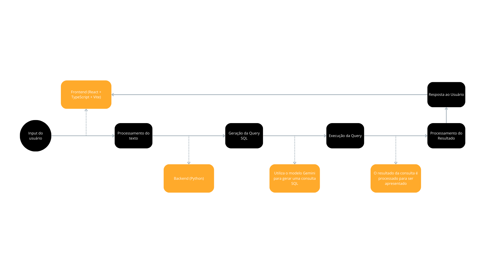
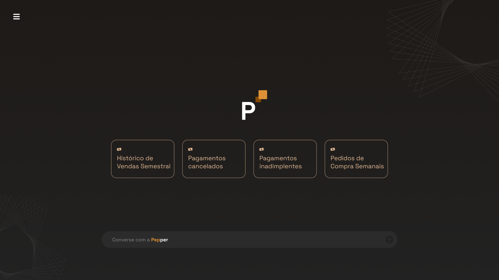
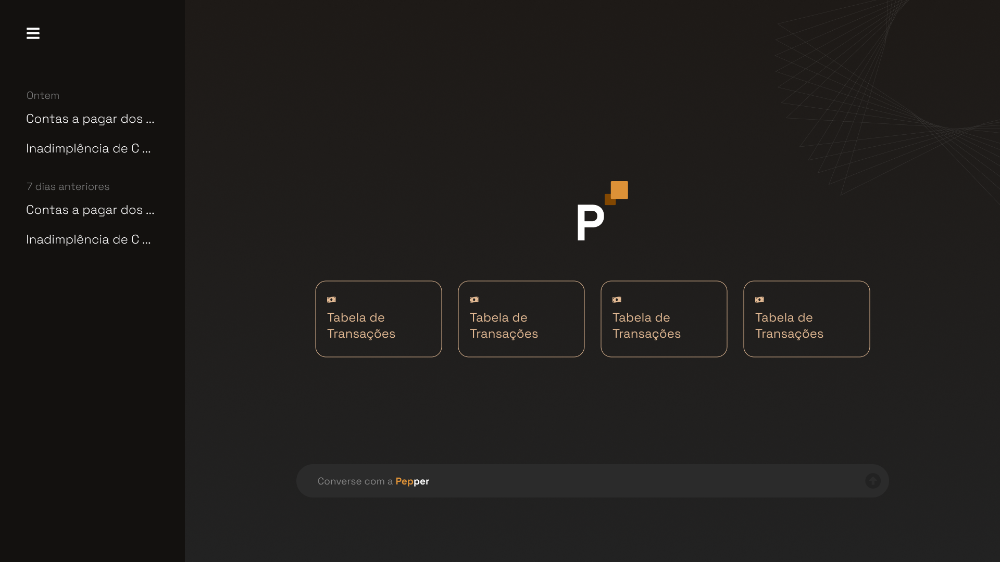

# Documentação Pepper

## Grupo - F.R.I.D.A.Y.

## Integrantes:
- <a href="https://www.linkedin.com/in/breno-santana-4a1912228/">Breno Santana</a>
- <a href="https://www.linkedin.com/in/laura-p-bueno/">Laura Bueno</a>
- <a href="https://www.linkedin.com/in/mateus-mar%C3%A7al/">Mateus Marçal</a>
- <a href="https://www.linkedin.com/in/matheusmeendes/">Matheus Mendes</a>
- <a href="https://www.linkedin.com/in/olincosta/">Ólin Medeiros</a>

## Sumário

[1. Introdução](#c1)

[2. Desenvolvimento e Análises de UX e Negócios](#c2)

[3. Análise e exploração dos dados](#c3)

[10. Referências](#c10)

 

# 1. Introdução

&emsp;&emsp;No cenário atual, onde a agilidade e a eficiência são de grande importância para o sucesso empresarial, a equipe F.R.I.D.A.Y. apresenta Pepper, a assistente virtual financeira projetada para transformar a maneira como as empresas interagem com suas finanças.

&emsp;&emsp;Com o objetivo de capacitar empresas de todos os portes, Pepper oferece acesso a informações financeiras personalizadas, consultas simplificadas em formato de texto, permitindo que os clientes tomem decisões mais estratégicas e otimizem seu tempo de busca.

&emsp;&emsp;Para escopo desse hackathon, integrando-se ao Web Banking do Stark Bank, Pepper proporciona uma experiência intuitiva e acessível, impulsionada por tecnologias de ponta como Processamento de Linguagem Natural (PLN) e Machine Learning. Através da combinação dessas ferramentas e da expertise da equipe F.R.I.D.A.Y., Pepper está pronta para revolucionar a gestão financeira empresarial, tornando-a mais eficiente, personalizada e estratégica.

&emsp;&emsp;Este documento detalhará a jornada de desenvolvimento da Pepper, desde a concepção até a implementação, explorando análises de negócios e UX, a arquitetura da solução, as tecnologias empregadas e os resultados alcançados. Além disso, serão discutidas as lições aprendidas e as perspectivas futuras para o aprimoramento contínuo da assistente virtual, consolidando o compromisso da Stark Bank em oferecer soluções inovadoras e centradas no cliente.

## 1.1 Objetivos

&emsp;&emsp;O projeto Pepper tem como objetivo central capacitar as empresas a consultar o gerenciamento das suas finanças de forma mais eficiente, estratégica e personalizada, através da implementação de uma assistente virtual financeira inovadora. Para alcançar esse objetivo, Pepper se propõe a fornecer acesso rápido e fácil a informações financeiras, promover a tomada de decisão informada, automatizar tarefas financeiras, personalizar a experiência do usuário, aprimorar a eficiência operacional, dentre outros.

## 1.2 Proposta da Solução

 
&emsp;&emsp;Para concretizar essa visão ambiciosa, Pepper será construída sobre uma arquitetura tecnológica robusta e escalável, utilizando serviços da AWS e frameworks Python como base. A solução combinará o poder do Processamento de Linguagem Natural (PLN) para interpretar as solicitações dos usuários com modelos de Machine Learning capazes de aprender e se adaptar continuamente, gerando querys SQL para requisições de dados e proporcionando respostas cada vez mais precisas e personalizadas. A integração, neste atual caso de uso com a API do Stark Bank garantirá acesso seguro e eficiente aos dados financeiros dos clientes, permitindo que Pepper forneça informações em tempo real e execute tarefas de forma automatizada.

## 1.3 Justificativa

 
&emsp;&emsp;A criação da assistente virtual financeira Pepper se justifica pela crescente necessidade das empresas de otimizar sua gestão financeira, tornando-a mais eficiente, estratégica e personalizada. Em um cenário cada vez mais competitivo e dinâmico, a capacidade de tomar decisões ágeis e embasadas em dados é fundamental para o sucesso empresarial. No entanto, muitas empresas ainda enfrentam desafios como dificuldade em acessar e interpretar informações financeiras de forma NoCode, processos manuais e demorados, falta de personalização, custos elevados, capacitação técnica, dentre outros.

 
&emsp;&emsp;Pepper surge como uma resposta a esses desafios, oferecendo uma solução acessível, eficiente e personalizada para a gestão financeira empresarial. Ao combinar o poder da inteligência artificial com a expertise de API's de gestão financeira, como soluções Web Banking, a assistente virtual tem o potencial de democratizar o acesso a informações financeiras, tornando-as mais compreensíveis e acessíveis a todos os usuários, independentemente de seu conhecimento técnico.

 
&emsp;&emsp;Também possui o potencial de automatizar consulta de informações e otimizar processos, liberando tempo e recursos para que a equipe se concentre em atividades estratégicas e de maior valor agregado. Personalizar a experiência do usuário, oferecendo informações  adaptadas às necessidades e ao perfil de cada empresa. Reduzir custos e aumentar a eficiência, minimizando a necessidade de intervenção humana em tarefas rotineiras e otimizando a gestão financeira. Além de fortalecer o relacionamento com o cliente, oferecendo um serviço inovador e de alto valor agregado, que demonstra o compromisso de bancos, como a Stark Bank em apoiar o sucesso de seus clientes.

# 2. Desenvolvimento e Análises de UX e Negócios

 
&emsp;&emsp;A criação de uma solução inovadora como a Pepper exige uma abordagem cuidadosa e estratégica, que leve em consideração tanto as necessidades dos usuários quanto os objetivos de negócio. Nesta seção, exploraremos como a equipe F.R.I.D.A.Y. conduziu análises aprofundadas de UX (User Experience) e de negócios para garantir que a Pepper entregasse uma experiência excepcional aos usuários, ao mesmo tempo em que gerasse valor para as empresas que a utilizam.

## 2.1. Domínio de Fundamentos de Negócio

 
&emsp;&emsp;A compreensão profunda do contexto de negócios é essencial para o sucesso de qualquer projeto. Para a Pepper, a equipe F.R.I.D.A.Y. se dedicou a analisar o mercado, identificar as necessidades dos clientes e definir uma estratégia sólida para o desenvolvimento e comercialização da assistente virtual financeira.

### 2.1.1. Lean Canvas

 
&emsp;&emsp;No cenário empresarial atual, a gestão financeira eficiente e estratégica é fundamental para o sucesso. Diante dos desafios enfrentados por empresas na análise e interpretação de dados financeiros complexos, a equipe F.R.I.D.A.Y. apresenta a Pepper, uma assistente virtual financeira inovadora.

 
&emsp;&emsp;A Pepper combina o poder do Processamento de Linguagem Natural (PLN) e do Machine Learning para transformar a maneira como as empresas interagem com suas finanças. Com foco em empresas que oferecem serviços de gestão financeira, como a Stark Bank, a Pepper visa agregar valor a essas soluções, proporcionando uma experiência mais inteligente, personalizada e eficiente para seus clientes.

 
   Figura 2 - Lean Canvas   
   
   Fonte: Autoria Própria  

 
&emsp;&emsp;A Pepper representa um avanço significativo na gestão financeira empresarial, oferecendo uma solução inovadora e de alto valor agregado. Ao combinar tecnologias avançadas de inteligência artificial com uma interface conversacional intuitiva, a Pepper capacita empresas a transformar dados financeiros em informações estratégicas, otimizar processos e tomar decisões mais embasadas.

 
&emsp;&emsp;Com seu foco no mercado B2B e sua capacidade de integração com diversas APIs de gestão financeira, a Pepper se destaca como uma ferramenta poderosa para empresas que buscam aprimorar seus serviços e oferecer uma experiência diferenciada aos seus clientes. Através da automação de consultas, análises personalizadas e aprendizado contínuo, a Pepper impulsiona a eficiência, a agilidade e o sucesso na gestão financeira empresarial.

 
&emsp;&emsp;A equipe F.R.I.D.A.Y. está comprometida em aprimorar continuamente a Pepper, incorporando novas funcionalidades e tecnologias para atender às necessidades em constante evolução do mercado. Com a Pepper, o futuro da gestão financeira empresarial se torna mais promissor, acessível e estratégico, abrindo caminho para um cenário de maior eficiência e sucesso para empresas de todos os portes.

### 2.1.2. Lean Inception

 
&emsp;&emsp;A Lean Inception da Pepper, a assistente virtual financeira desenvolvida para otimizar o gerenciamento financeiro, estabelece uma visão clara do que essa inovadora ferramenta representa e o que ela se propõe a realizar. Pepper é concebida como uma aliada inteligente e personalizada na gestão financeira empresarial, utilizando tecnologias de ponta, como os serviços da AWS para fornecer informações, análises e automação de tarefas, impulsionando a tomada de decisão estratégica. Ao mesmo tempo, a Lean Inception delimita o escopo da Pepper, esclarecendo o que ela não é e o que não faz, garantindo que as expectativas dos usuários estejam alinhadas com suas funcionalidades. Essa definição clara do propósito e dos limites da Pepper é essencial para orientar seu desenvolvimento e garantir que ela atenda às necessidades específicas dos clientes de bancos como o Stark Bank, impulsionando sua eficiência e sucesso financeiro.

 
   Figura 3 - Lean Inception Pepper   
   
   Fonte: Autoria Própria  

 

 
&emsp;&emsp;A Lean Inception da Pepper estabeleceu uma base sólida para o desenvolvimento da assistente virtual, definindo claramente seu propósito, funcionalidades e limites. A partir dessa visão, a equipe se dedicou a construir uma solução robusta e escalável, combinando tecnologias de ponta, como Processamento de Linguagem Natural e Machine Learning.

### 2.1.3. Value Proposition Canvas

 
&emsp;&emsp;O Value Proposition Canvas (VPC) é uma ferramenta estratégica usada para garantir que um produto ou serviço esteja alinhado com as necessidades e desejos do cliente, permitindo mapear detalhadamente os Customer Jobs, ou seja, as tarefas que os clientes precisam realizar, as Gains, que são os benefícios esperados, e as Pains, que são as dores ou frustrações enfrentadas. A partir disso, o VPC ajuda a criar soluções que maximizem os Gains e aliviem os Pains, por meio de Pain Relievers e Gain Creators claros e eficazes, que integram os Products & Services.

&emsp;&emsp;No contexto do projeto, o VPC é crucial para garantir que a solução desenvolvida, neste caso, a assistente virtual financeira Pepper, esteja ajustada para atender às principais demandas dos proprietários de PMEs. Com a análise estruturada do VPC, foi possível identificar que os clientes precisam de um acesso simplificado e rápido às informações financeiras e de ferramentas que transformem dados brutos em insights úteis. Ao mapear as dores e ganhos dos clientes, o projeto pode focar em criar uma experiência de valor, com respostas claras, automação de consultas e insights estratégicos.

 
   Figura 4 - Value Proposition Canvas   
   
   Fonte: Autoria Própria  

### 2.1.4. Benchmark

 
&emsp;&emsp;Este documento apresenta um benchmark da Pepper, uma assistente virtual financeira projetada para empresas que oferecem serviços de gestão financeira. O objetivo é analisar o posicionamento da Pepper em relação a outros players do mercado, destacando seus diferenciais e oportunidades.

<b>Acesso a informações financeiras: Comparativo com soluções existentes</b>

 
&emsp;&emsp;A tabela abaixo compara a Pepper com algumas das principais soluções de acesso a informações financeiras disponíveis no mercado:

|Funcionalidade|Pepper|QuickBooks, Xero, ContaAzul|
|--------------|------|---------------------------|
|Acesso a informações financeiras|Acesso rárido e fácil, via linguagem natural, consultas personalizadas e em tempo real| Interfaces complexas, relatórios estáticos, dificuldade em encontrar informações específicas, consultas personalizadas geralmente exigem conhecimento técnico|
|Interface conversacional|Interação intuitiva e em linguagem natural|Interfaces tradicionais, necessidade de treinamento e conhecimento técnico|
|Integração com APIs|Integração com diversas APIs de gestão financeira, acesso a dados em tempo real|Integrações limitadas, dificuldade em conectar diferentes fontes de dados|
|Aprendizado contínuo|Capacidade de aprender e se adaptar continuamente às necessidades dos usuários|Soluções estáticas, pouca capacidade de evolução e aprendizado|

<b>Descrição dos Players</b>

<li><b>QuickBooks, Xero e ContaAzul:</b> São softwares de gestão financeira amplamente utilizados por pequenas e médias empresas, oferecendo funcionalidades como contabilidade, faturamento, gestão de despesas e relatórios financeiros. No entanto, eles geralmente apresentam interfaces complexas e exigem conhecimento técnico para acessar informações específicas e gerar relatórios personalizados.</li>

<li><b>Outras soluções de gestão financeira:</b> Existem diversas outras soluções no mercado, como Oracle NetSuite, SAP Business One e Sage Intacct, que atendem a empresas de diferentes portes e segmentos. No entanto, a maioria delas também apresenta interfaces complexas e exige conhecimento técnico para acessar informações financeiras de forma eficiente.
</li>

 

<b>Comparativo com IAs de Bancos</b>

 
&emsp;&emsp;A tabela abaixo compara a Pepper com IAs de bancos, como a BIA do Bradesco:

|Característica|Pepper|IAs de Bancos (ex: BIA)|
|--------------|------|-----------------------|
|Público-alvo|Empresas que oferecem serviços de gestão financeira (B2B) / PMEs com dificuldades de consultar seus dados financeiros (B2B)|Clientes finais dos bancos (B2C)|
|Foco|Agregar valor às soluções de gestão financeira empresarial, oferecendo insights e automação para otimizar processos e auxiliar na tomada de decisões|Atendimento ao cliente, suporte técnico, informações sobre produtos e serviços bancários, transações financeiras básicas|
|Integração|Integração com diversas APIs de gestão financeira, permitindo acesso a dados de diferentes fontes e personalização das análises|Integração principalmente com os sistemas internos do banco, com foco em informações e transações específicas da instituição|
|Profundidade das análises|Capacidade de fornecer análises financeiras mais personalizadas, com base em dados de diferentes fontes e aprendizado de máquina|Análises mais básicas e focadas em informações e transações do próprio banco|
|Automação de tarefas|Automação de consultas e tarefas financeiras complexas, liberando tempo para atividades estratégicas|Automação de tarefas mais simples e transacionais, como consultas de saldo, pagamentos e transferências|

<b>Diferenciais da Pepper e Relacionamento com o Mercado</b>

 
&emsp;&emsp;A Pepper se diferencia no mercado por oferecer:

<li><b>Acesso simplificado e personalizado a informações financeiras:</b> Através de uma interface conversacional intuitiva e em linguagem natural, a Pepper permite que os usuários acessem informações financeiras de forma rápida e fácil, sem necessidade de conhecimento técnico especializado.</li>
<li><b>Automação inteligente de tarefas:</b> A Pepper automatiza consultas e tarefas financeiras complexas, liberando tempo para atividades mais importantes e estratégicas.</li>
<li><b>Integração flexível:</b> A capacidade de se conectar a diversas APIs de gestão financeira permite que a Pepper acesse dados de diferentes fontes, proporcionando uma visão completa e integrada das finanças da empresa.</li>
<li><b>Foco no B2B:</b> Diferente de outras IAs financeiras, a Pepper é voltada para empresas que oferecem serviços de gestão financeira, agregando valor às suas soluções e ajudando-as a se destacarem no mercado.</li>

 

<b>Conclusão</b>

 
&emsp;&emsp;Com base no benchmark realizado, podemos concluir que a Pepper apresenta diferenciais significativos em relação às soluções existentes no mercado, tanto em comparação com softwares tradicionais de gestão financeira quanto com IAs de bancos.

 
&emsp;&emsp;Não foram encontradas soluções aplicadas no mercado brasileiro que chegassem a ser uma concorrente direta da Pepper, combinando o foco no B2B, a capacidade de integração com múltiplas APIs, a interface conversacional intuitiva e o aprendizado contínuo.

 
&emsp;&emsp;Dessa forma, empresas do segmento de acesso a informações financeiras, como a Stark Bank, se enquadram mais como potenciais usuárias dos serviços da Pepper, que pode agregar valor às suas soluções existentes e ajudá-las a oferecer uma experiência mais completa e personalizada aos seus clientes.

### 2.1.5. Análise financeira

 
&emsp;&emsp;A análise financeira da Pepper visa projetar os custos e receitas associados ao desenvolvimento, implantação e comercialização da assistente virtual, a fim de avaliar sua viabilidade econômica e potencial de retorno sobre o investimento. A priori, não foi possível realizar grandes consultas dos custos que o projeto pode ter. Sendo assim, aqui será apresentado uma estimativa desses custos e essa análise será aprimorada ao longo do desenvolvimento da Pepper.

<b>Custos:</b>

<ul>
<li><strong>Desenvolvimento:</strong>
<ul>
<li>Estimativa: Investimento inicial de R$ 12.000,00 (incluindo infraestrutura, ferramentas e licenças). Por ser uma startup, a equipe de desenvolvimentose resume aos idealizadores da Pepper.</li>
</ul>
</li>
<li><strong>Infraestrutura e Hospedagem:</strong>
<ul>
<li>Estimativa: R$ 200,00 mensais (considerando servidores, armazenamento em nuvem na AWS e serviços de banco de dados).</li>
</ul>
</li>
<li><strong>Integração com APIs:</strong>
<ul>
<li>Estimativa: R$ 0,00 mensais. Considerando o atual modelo de negócios, a integração com API's seria gratuita, tendo em vista que a Pepper estaria agregando valor em um serviço que já consolidado.</li>
</ul>
</li>
<li><strong>Marketing e Vendas:</strong>
<ul>
<li>Estimativa: R$ 300,00 mensais (incluindo campanhas de marketing, equipe de vendas e comissões).</li>
</ul>
</li>
<li><strong>Suporte ao Cliente:</strong>
<ul>
<li>Estimativa: R$ 0,00 mensais. Novamente a equipe idealizadora da Pepper a priori estariam a frente esse serviço.</li>
</ul>
</li>
</ul>

<b>Receitas:</b>

<ul>
<li><strong>Assinaturas:</strong>
<ul>
<li>Plano Básico (Pequenas empresas e startups): R$ 100,00/mês</li>
<li>Plano Profissional (Pequenas e médias empresas): R$ 250,00/mês</li>
<li>Plano Corporativo (Grandes empresas): R$ 500,00/mês</li>
</ul>
</li>
<li><strong>Parcerias:</strong>
<ul>
<li>Estimativa: R$ 10.000,00 mensais por parceria (com instituições financeiras) ou uma porcentagem definida de receita mensal.</li>
</ul>
</li>
<li><strong>Venda de módulos ou funcionalidades extras:</strong>
<ul>
<li>Estimativa: R$ 50,00/mês por módulo adicional.</li>
</ul>
</li>
</ul>

<b>Projeções Financeiras (Estimativa):</b>

<ul>
<li><strong>Investimento Inicial:</strong> R$ 12.000,00</li>
<li><strong>Custos Fixos Mensais:</strong> R$ 500,00</li>
<li><strong>Custos Variáveis:</strong> R$ 0,00 por usuário/mês (suporte e acesso a APIs são gratuitos no modelo atual)</li>
<li><strong>Receita Mensal:</strong>
<ul>
<li>Cenário Conservador: 10 assinantes (5 Básico, 3 Profissional, 2 Corporativo) = R$ 2.000,00</li>
<li>Cenário Realista: 20 assinantes (10 Básico, 6 Profissional, 4 Corporativo) = R$ 4.000,00</li>
<li>Cenário Otimista: 30 assinantes (15 Básico, 9 Profissional, 6 Corporativo) = R$ 6.000,00</li>
</ul>
</li>
<li><strong>Ponto de Equilíbrio:</strong>
<ul>
<li>Cenário Conservador: Aproximadamente 7 assinantes</li>
<li>Cenário Realista: Aproximadamente 3 assinantes</li>
<li>Cenário Otimista: Aproximadamente 2 assinante</li>
</ul>
</li>
<li><strong>Retorno sobre o Investimento (ROI):</strong>
<ul>
<li><strong>Cenário Conservador:</strong>
<ul>
<li>Receita mensal: R$ 2.000,00</li>
<li>Lucro mensal: R$ 1.500,00 (Receita - Custos Fixos)</li>
<li>Tempo para recuperar o investimento: 8 meses (Investimento Inicial / Lucro mensal)</li>
</ul>
</li>
<li><strong>Cenário Realista:</strong>
<ul>
<li>Receita mensal: R$ 4.000,00</li>
<li>Lucro mensal: R$ 3.500,00</li>
<li>Tempo para recuperar o investimento: 3.4 meses</li>
</ul>
</li>
<li><strong>Cenário Otimista:</strong>
<ul>
<li>Receita mensal: R$ 6.000,00</li>
<li>Lucro mensal: R$ 5.500,00</li>
<li>Tempo para recuperar o investimento: 2.2 meses</li>
</ul>
</li>
</ul>
</li>
</ul>

<b>Análise de Sensibilidade:</b>

<ul>
<li>Aumento nos custos de desenvolvimento: Impacto relativamente baixo no investimento inicial, considerando o valor já reduzido.</li>
<li>Custos com suporte e integrações no futuro: Caso o modelo de negócios mude, esses custos podem aumentar, impactando o ponto de equilíbrio e o ROI.</li>
<li>Redução na receita por assinante: Aumento no número de assinantes necessário para atingir o ponto de equilíbrio.</li>
<li>Entrada de novos concorrentes: Impacto na taxa de conversão e retenção de clientes.</li>
<li>Mudanças regulatórias: Possível necessidade de adaptação da solução e aumento nos custos.</li>
</ul>

<b>Conclusão:</b>

 
&emsp;&emsp;Com as modificações na análise financeira, a Pepper demonstra um potencial de viabilidade econômica ainda mais promissor, com um ROI significativamente mais rápido em todos os cenários. É fundamental monitorar as métricas-chave e realizar análises de sensibilidade para garantir o sucesso da Pepper no mercado, especialmente se houver mudanças no modelo de negócios ou no cenário competitivo.

### 2.1.6. Entendimento Modelo de Vendas

 
&emsp;&emsp;Com base no entendimento do negócio e na identificação do problema a ser solucionado pela Pepper, foi elaborado um diagrama inicial simples do modelo de vendas. Este diagrama tem como objetivo auxiliar na compreensão do perfil do cliente e da estratégia de disponibilização da Pepper no mercado. O diagrama foi elaborado utilizando o software [Excalidraw](https://excalidraw.com).

 
   Figura 5 - Diagrama de Modelo de Vendas   
   
   Fonte: Autoria Própria  

 
&emsp;&emsp;O diagrama representa as organizações para as quais o produto será disponibilizado. Nesse contexto, o software será comercializado por meio de licenças, cada uma representando um usuário da empresa. Este modelo de vendas é direcionado para empresas e não para o cliente final da empresa aplicadora do software (PMEs).

 
&emsp;&emsp;Uma das principais vantagens desse modelo de negócios é a previsibilidade de receita, uma vez que a comercialização de licenças geralmente envolve contratos recorrentes, seja mensal ou anualmente. Isso permite um fluxo de caixa mais estável e facilita o planejamento financeiro da empresa dona da Pepper. Além disso, o modelo de licenciamento por usuário possibilita uma escalabilidade flexível, permitindo que as empresas ajustem o número de licenças conforme suas necessidades crescem ou diminuem.

## 2.2 Entendimento da Experiência do Usuário

 
&emsp;&emsp;No desenvolvimento da Pepper, a compreensão profunda das necessidades e desafios dos usuários é fundamental. Para isso, foram definidas duas personas que representam os principais grupos de usuários da assistente virtual: João, o dono de uma PME, e Carla, a Gerente de Compras. Essas personas nos permitem entender suas dores, responsabilidades e como a Pepper pode agregar valor em suas rotinas de trabalho, impulsionando a gestão financeira de suas empresas.

### 2.2.1 Personas

#### **Persona 1:** João, o dono de uma PME ( pequena e média empresa )

- **Idade:** 45 anos.

- **Profissão:** Dono de uma pequena / média empresa de varejo.

- **Responsabilidades:** Gestão financeira completa do negócio, incluindo toda a gestão do fluxo de caixa e do balanço patrimonial da empresa, trazendo as melhores recomendações para o CEO e embasando a sua tomada de decisão.

- **Papel:** Gerenciar o fluxo de caixa, otimizar despesas corporativas e garantir que a empresa tenha uma visão clara das suas finanças.

- **Dores:** Dificuldade em acessar dados específicos e personalizados de controle de caixa e saúde financeira da empresa. Pressão para reduzir custos financeiros, principalmente com a gestão de múltiplas contas empresariais e serviços bancários.

- **Caso de Uso 1:** Requisição de custos operacionais de vendas e marketing. João utiliza a Pepper para analisar os custos operacionais relacionados ao faturamento bruto da empresa.

- **Benefício:** Estas informações permitem que o João consiga analisar se os custos de vendas e marketing estão dando retorno para a empresa, auxiliando na tomada de decisão relacionada ao caixa orçamentário para a área de aquisição de clientes ( funil de vendas ).

- **Caso de Uso 2:** Análise Orçamentária Individual de Áreas. Através da Pepper, João consegue analisar os pedidos de compras dos diversos segmentos da empresa, atualizando os orçamentos destas áreas.

- **Benefício:** Auxilia no controle orçamentário das áreas da empresa separadamente e com espaços de tempo específicos, permitindo a análise mensal, semestral, anual, entre outros. 

#### **Persona 2:** Carla, a Gerente de Compras

- **Idade:** 32 anos.

- **Profissão:** Gerente de Compras de uma empresa de serviços.

- **Responsabilidades:** Gerencia as atividades de compras através de orçamentos, controle de custos e definição de parâmetros para novas aquisições, também faz fechamento de pedidos a fim de ter as melhores condições de preços, qualidade e prazo de entrega.

- **Papel:** Acompanhar e controlar as compras realizadas na empresa, sendo responsável por orçamento que beneficiarão a empresa.

- **Dores:** Dificuldade no acesso de informações relacionadas a transações de compras da organização de forma direta e intuitiva. Obstáculos envolvendo a análise de dados relacionados a gastos frequentes de reposição de estoque.

- **Caso de Uso 1:** Carla utiliza a Pepper para conseguir informações detalhadas sobre transações de compras da organização, visando receber estes dados de forma centralizada.

- **Benefício:** Ao utilizar a solução Carla consegue otimizar sua busca para categorias de compras específicas, adquirindo informações sobre custos de matérias primas para produção, por exemplo.

- **Caso de Uso 2:** Ao utilizar a Pepper, Carla consegue visualizar os gastos frequentes referente a reposição de estoque de forma simples através de uma interface amigável.

- **Benefício:** Direciona a análise de custos de forma clara, facilitando a interpretação de gastos e analisando o histórico de preço de seu fornecedor. Tal histórico possibilita que Carla analise se o fornecedor está dentro dos gastos direcionados à elaboração do produto comercializado.

# 3. Análise e exploração dos dados 

 
&emsp;&emsp;A equipe F.R.I.D.A.Y. realizou uma análise exploratória dos dados fornecidos pela Stark Bank, abrangendo as tabelas de 'transfer', 'transaction', 'invoice' e corporate-purchase. O objetivo desta análise foi compreender a estrutura, características e nuances dos dados, a fim de identificar oportunidades para a aplicação da assistente virtual Pepper e direcionar o desenvolvimento da solução.

<b>Principais conclusões de análise exploratória:</b>

<li><b>Dados de 'corporate-purchase' como foco:</b> A análise revelou que os dados de corporate-purchase oferecem o maior potencial para demonstrar as funcionalidades da Pepper, devido à riqueza de informações sobre compras corporativas, incluindo datas, categorias, fornecedores e valores.</li>

<li><b>Limpeza e pré-processamento:</b> Os dados brutos necessitaram de limpeza e pré-processamento para garantir a qualidade e a consistência das informações. A coluna created na tabela corporate-purchase foi convertida para o formato datetime para facilitar a análise temporal.</li>

<li><b>Identificação de padrões e tendências:</b> A análise estatística descritiva e a contagem de valores para colunas categóricas revelaram insights importantes sobre o comportamento das compras corporativas, como os principais fornecedores, categorias de gastos e status das transações.
   <ul>
      <li><b>Consultas em linguagem natural:</b> Os usuários poderiam fazer perguntas como "Qual foi o gasto total com viagens no último trimestre?" ou "Quais são os principais fornecedores da categoria 'Tecnologia'?"</li>
      <li><b>Análises personalizadas:</b> A Pepper poderia gerar relatórios personalizados sobre o comportamento de gastos, identificar áreas de oportunidade para redução de custos e fornecer insights para a tomada de decisões estratégicas.</li>
      <li><b>Alertas e notificações:</b> A Pepper poderia monitorar as transações e enviar alertas sobre gastos excessivos, transações suspeitas ou oportunidades de economia.</li>
   </ul>
</li>

 
&emsp;&emsp;A análise e exploração dos dados fornecidos pela Stark Bank foram fundamentais para direcionar o desenvolvimento da Pepper. A equipe F.R.I.D.A.Y. utilizou os insights obtidos para definir as funcionalidades da assistente virtual, priorizar o desenvolvimento e garantir que a solução atenda às necessidades reais dos usuários. A análise exploratória continuará sendo um processo contínuo, permitindo que a Pepper aprenda e se adapte às necessidades em constante evolução do mercado de gestão financeira empresarial.

# 4. Desenvolvimento da Solução 

 
&emsp;&emsp;A jornada de desenvolvimento da Pepper foi guiada por uma abordagem ágil e iterativa, com foco na entrega contínua de valor e na colaboração entre as equipes de desenvolvimento, design e negócios. A equipe F.R.I.D.A.Y. utilizou metodologias como Scrum e Kanban para garantir a flexibilidade e a adaptação às necessidades em constante mudanças no escopo. O projeto conta com uma solução robusta e escalável, combinando tecnologias de ponta como Processamento de Linguagem Natural (PLN), Machine Learning e integração com APIs de gestão financeira.

## 4.1. Arquitetura da Solução

 
&emsp;&emsp;A arquitetura da Pepper é projetada para fornecer uma experiência de usuário intuitiva e eficiente, permitindo que os usuários façam perguntas em linguagem natural sobre seus dados financeiros e recebam respostas personalizadas e consultas acionáveis. A arquitetura é composta por um frontend em React, um backend em Python e um banco de dados hospedado na AWS. O modelo de linguagem utilizado para gerar consultas SQL a partir das perguntas dos usuários é o Gemini da Google.

 
   Figura 6 - Arquitetura da Solução   
   
   Fonte: Autoria Própria  

<b>Visão Geral</b>

 
&emsp;&emsp;A arquitetura da Pepper é composta por três camadas principais:

<ol>
<li><strong>Frontend:</strong> Responsável pela interface do usuário, onde os usuários interagem com a Pepper, fazem perguntas e visualizam as respostas.</li>
<li><strong>Backend:</strong> Processa as perguntas dos usuários, gera consultas SQL, executa-as no banco de dados e formata as respostas para serem apresentadas no frontend.</li>
<li><strong>Banco de Dados:</strong> Armazena os dados financeiros da empresa e permite a execução de consultas SQL para extrair informações relevantes.</li>
</ol>

<b>Fluxo de Trabalho</b>

<ol>
<li><strong>Input do Usuário:</strong> O usuário insere uma pergunta em linguagem natural na interface do frontend.</li>
<li><strong>Processamento do Texto:</strong> O backend recebe a pergunta e a processa utilizando técnicas de PLN para entender a intenção do usuário e extrair informações relevantes.</li>
<li><strong>Geração da Query SQL:</strong> Com base na análise do texto, o backend utiliza o modelo Gemini para gerar uma consulta SQL estruturada que buscará as informações desejadas no banco de dados.</li>
<li><strong>Execução da Query:</strong> A consulta SQL é enviada ao banco de dados, que a executa e retorna os resultados.</li>
<li><strong>Processamento do Resultado:</strong> O backend recebe os resultados da consulta e os processa, transformando-os em uma resposta clara e compreensível para o usuário.</li>
<li><strong>Resposta ao Usuário:</strong> A resposta processada é enviada de volta ao frontend e exibida ao usuário na interface.</li>
</ol>

<b>Componentes e Tecnologias</b>

<ul>
<li><strong>Frontend:</strong> Desenvolvido em React com TypeScript e Vite, proporcionando uma interface moderna, responsiva e de alta performance.</li>
<li><strong>Backend:</strong> Implementado em Python, utilizando o framework FastAPI para criar uma API RESTful eficiente e escalável. O modelo Gemini é utilizado para a geração de consultas SQL, e o SQLAlchemy para a interação com o banco de dados.</li>
<li><strong>Banco de Dados:</strong> Hospedado na AWS, oferecendo segurança, escalabilidade e alta disponibilidade.</li>
<li><strong>Gemini:</strong> Modelo de linguagem da Google utilizado para gerar consultas SQL a partir das perguntas dos usuários.</li>
</ul>

<b>Benefícios da Arquitetura</b>

<ul>
<li><strong>Escalabilidade:</strong> A arquitetura permite que a Pepper seja facilmente escalada para atender a um número crescente de usuários e empresas.</li>
<li><strong>Flexibilidade:</strong> A utilização de APIs possibilita a integração com diferentes fontes de dados e a adição de novas funcionalidades no futuro.</li>
<li><strong>Manutenibilidade:</strong> A separação clara entre frontend e backend facilita a manutenção e atualização da solução.</li>
<li><strong>Segurança:</strong> A hospedagem na AWS e a implementação de boas práticas de segurança garantem a proteção dos dados financeiros dos usuários.</li>
</ul>

<b>Conclusão</b>

 
&emsp;&emsp;A arquitetura da Pepper foi cuidadosamente projetada para oferecer uma solução robusta, escalável e segura para a gestão financeira empresarial. A combinação de tecnologias avançadas de inteligência artificial com uma interface intuitiva e amigável permite que a Pepper transforme a maneira como as empresas interagem com suas finanças, impulsionando a eficiência, a tomada de decisões estratégicas e o sucesso no mercado.

## 4.2. Documentação da API

 
&emsp;&emsp;Esta API fornece um endpoint para gerar consultas SQL com base em entradas em linguagem natural e retornar uma resposta detalhada com base nos resultados da consulta SQL. A API utiliza o Gemini para processamento de linguagem natural, a fim de formular consultas SQL e gerar respostas em linguagem natural.

### URL Base

http://localhost:8000

### Endpoints

### 4.2.1. Processar Texto

#### Descrição

 
&emsp;&emsp;Gera uma consulta SQL com base na entrada em linguagem natural fornecida no corpo da solicitação. A consulta SQL é executada e o resultado é usado para formular uma resposta em linguagem natural. A resposta é então retornada na resposta.

#### URL

POST /process-text/

#### Solicitação

- **Cabeçalhos**
  - Content-Type: `application/json`

- **Parâmetros do Corpo**

  - `text` (string, obrigatório): A entrada em linguagem natural contendo a pergunta ou solicitação de informação.

  **Exemplo de Solicitação:**

  json
  {
    "text": "Eu quero saber o quanto eu gastei nos últimos 6 meses."
  }

#### Resposta

- **200 OK**

  - Retorna a resposta em linguagem natural com base nos resultados da consulta SQL.
  
  **Exemplo de Resposta:**

  json
  {
    "response": "Nos últimos 6 meses, você gastou um total de R$ 10.500,00."
  }

- **400 Bad Request**

  - Retorna uma mensagem de erro se a entrada for inválida ou se o processo de geração de SQL falhar.
  
  **Exemplo de Resposta:**

  json
  {
    "detail": "Formato de solicitação inválido."
  }

- **500 Internal Server Error**

  - Retorna uma mensagem de erro se a consulta SQL não puder ser gerada e executada após várias tentativas.
  
  **Exemplo de Resposta:**

  json
  {
    "detail": "Não foi possível gerar e executar uma consulta SQL válida após várias tentativas."
  }

#### Tratamento de Erros

- A API inclui tratamento de erros para tentar gerar e executar a consulta SQL novamente até um número máximo de iterações (`max_iterations` definido como 5).
- Se a consulta SQL não puder ser gerada e executada com sucesso dentro das tentativas permitidas, a API retorna um `500 Internal Server Error`.

### Exemplo de Uso

#### cURL

bash
curl -X POST http://localhost:8000/process-text/ \
-H "Content-Type: application/json" \
-d '{"text": "Eu quero saber o quanto eu gastei nos últimos 6 meses."}'

#### Postman

1. Defina o método como `POST`.
2. Insira a URL: `http://localhost:8000/process-text/`.
3. Defina o corpo da solicitação como raw e selecione `JSON`.
4. Insira o JSON da solicitação:
   json
   {
     "text": "Eu quero saber o quanto eu gastei nos últimos 6 meses."
   }
5. Envie a solicitação.

### Notas

- Certifique-se de que a chave da API para o Gemini esteja configurada corretamente em suas variáveis de ambiente.
- Esta API foi projetada para casos de uso em que consultas SQL precisam ser geradas dinamicamente com base em entradas em linguagem natural, particularmente no contexto de transações financeiras.
- A API está equipada com tratamento de erros e registro robustos para garantir confiabilidade. 

## 4.3. Frontend da solução

 
&emsp;&emsp;Este tópico aborda o desenvolvimento do frontend da Pepper, a assistente virtual financeira. O objetivo é apresentar as especificações e a abordagem técnica adotada para a criação da interface do usuário, garantindo que a solução seja eficiente e fácil de usar. 
 

&emsp;&emsp;O frontend da Pepper foi desenvolvido com foco em fornecer uma interface clara, funcional e simples, que permita aos usuários acessar informações financeiras e interagir com a assistente de forma eficiente. Utilizando tecnologias modernas e seguindo as melhores práticas de design e desenvolvimento, a solução foi projetada para oferecer uma experiência de usuário intuitiva e responsiva. 

&emsp;&emsp;A interface da Pepper foi desenvolvida utilizando como base produtos que já funcionam dentro do mercado, como o Chat Gpt, Perplexity AI e Gemini AI. Sob essa ótica, abaixo estão representadas as telas desenvolvidas do frontend

 
   Página Inicial Pepper   
   
   Fonte: Desenvolvido pelo Grupo. Foto retirada do Mockup  

 
   Página Inicial Pepper com Side Bar   
   
   Fonte: Desenvolvido pelo Grupo. Foto retirada do Mockup  

 
   Página de Output   
   
   Fonte: Desenvolvido pelo Grupo. Foto retirada do Mockup  

 
   Página de Output com Side Bar   
   
   Fonte: Desenvolvido pelo Grupo. Foto retirada do Mockup  

&emsp;&emsp;A partir da análise das telas desenvolvidas, é possível observar que a plataforma é simples e intuitiva de utilizar. A escolha de se basear em produtos amplamente utilizados no mercado visa facilitar a aceitação dos usuários em relação à plataforma e otimizar a busca por suas funcionalidades. O design da plataforma foi elaborado com base em princípios de UX e UI, incluindo os cinco princípios do design visual: escala, contraste, equilíbrio, hierarquia visual e forma.

## 4.4. Performace da Pepper

 
&emsp;&emsp;A performance da Pepper foi avaliada durante o desenvolvimento, com foco na otimização do tempo de resposta e na capacidade de fornecer informações relevantes de forma eficiente.

<b>Métricas de Desempenho</b>

 
<b>Tempo médio de resposta:</b> A Pepper apresentou um tempo médio de resposta de 3 segundos, significativamente inferior ao tempo médio de 30-60 segundos que um usuário levaria para obter as mesmas informações analisando um dashboard tradicional, de acordo com referências do Perplexity. Essa agilidade representa um ganho de eficiência de até 95%, permitindo que os usuários acessem insights financeiros de forma rápida e dinâmica.

<b>Métricas Futuras</b>

 
&emsp;&emsp;Com a implementação da Pepper no mercado, será possível coletar e analisar métricas adicionais para avaliar sua performance e impacto nos negócios dos clientes, como:

<ul>
<li><strong>Taxa de adoção:</strong> Percentual de usuários que utilizam a Pepper ativamente após a implementação.</li>
<li><strong>Frequência de uso:</strong> Número médio de interações dos usuários com a Pepper por período (dia, semana, mês).</li>
<li><strong>Satisfação do usuário:</strong> Avaliação da satisfação dos usuários com a Pepper através de pesquisas e feedbacks.</li>
<li><strong>Redução de custos:</strong> Estimativa da economia de tempo e recursos gerada pela automação de consultas e tarefas financeiras.</li>
<li><strong>Impacto na tomada de decisões:</strong> Avaliação do impacto da Pepper na qualidade e agilidade das decisões estratégicas tomadas pelas empresas.</li>
</ul>

# 5. Roadmap de Prospecção 

 
&emsp;&emsp;A Pepper é uma solução que estará em constante evolução, projetada para se adaptar às necessidades do mercado e oferecer cada vez mais valor aos seus usuários. Para garantir seu crescimento e aprimoramento contínuo, a equipe F.R.I.D.A.Y. elaborou um roadmap de prospecção, que define as principais funcionalidades e melhorias a serem implementadas a curto, médio e longo prazo.

<b>Visão Geral do Roadmap</b>

 
&emsp;&emsp;O roadmap da Pepper se baseia em três pilares principais:

<ol>
<li><strong>Aprimoramento da experiência do usuário:</strong> Tornar a interação com a Pepper ainda mais intuitiva, eficiente e personalizada.</li>
<li><strong>Expansão das funcionalidades:</strong> Adicionar novas funcionalidades e integrações para atender a um público mais amplo e a diferentes necessidades de gestão financeira.</li>
<li><strong>Escalabilidade e performance:</strong> Garantir que a Pepper possa lidar com um volume crescente de dados e usuários, mantendo um alto nível de desempenho e confiabilidade.</li>
</ol>

<b>Tabela de Prospecção</b>

## Roadmap de Prospecção da Pepper

| Período | Upgrade | Descrição | Impacto Esperado |
|---|---|---|---|
| **Curto Prazo (0-6 meses)** | Melhorias na interface do usuário | Refinamento da interface, incluindo design, usabilidade e acessibilidade | Aumento da satisfação e engajamento dos usuários |
| | Novas categorias de consultas | Ampliar o leque de perguntas que a Pepper pode responder, incluindo consultas sobre fluxo de caixa, projeções financeiras e indicadores de desempenho | Maior utilidade e valor percebido pelos usuários |
| | Integração com outras API's | Integrar a Pepper com outras APIs de gestão financeira para ampliar a gama de dados e serviços acessíveis, permitindo atender a um público mais amplo e diversificado | Maior escalabilidade e flexibilidade da solução, possibilitando a expansão para diferentes nichos de mercado e o atendimento a necessidades específicas de gestão financeira |
| **Médio Prazo (6-12 meses)** | Análises preditivas e prescritivas | Utilizar modelos de Machine Learning para prever tendências financeiras e oferecer recomendações personalizadas para otimizar a gestão financeira | Auxiliar os usuários na tomada de decisões estratégicas e proativas |
| | Automação de tarefas mais complexas | Expandir a capacidade da Pepper para automatizar tarefas financeiras mais complexas, como conciliação bancária, geração de relatórios e pagamentos | Aumento da eficiência operacional e redução de custos para as empresas |
| | Suporte a múltiplos idiomas | Permitir que a Pepper interaja com os usuários em diferentes idiomas, expandindo seu alcance e acessibilidade | Aumento da base de usuários e penetração em novos mercados |
| **Longo Prazo (12+ meses)** | Integração com outras fontes de dados | Conectar a Pepper a outras fontes de dados relevantes para a gestão financeira, como sistemas de ERP, CRM e plataformas de e-commerce | Oferecer uma visão ainda mais completa e integrada das finanças da empresa |
| | Personalização avançada | Utilizar técnicas de aprendizado de máquina para oferecer uma experiência ainda mais personalizada, adaptando as respostas e análises ao perfil e histórico de cada usuário | Aumento da relevância e do valor percebido da Pepper |
| | Expansão para o mercado B2C | Adaptar a Pepper para atender também às necessidades de pessoas físicas na gestão de suas finanças pessoais | Aumento do mercado potencial e da base de usuários | 

 
&emsp;&emsp;O roadmap de prospecção da Pepper demonstra o compromisso da equipe F.R.I.D.A.Y. em aprimorar continuamente a solução, oferecendo novas funcionalidades, expandindo sua capacidade de integração e garantindo uma experiência cada vez mais personalizada e eficiente para os usuários. Com um plano de desenvolvimento claro e focado nas necessidades do mercado, a Pepper tem o potencial de se tornar uma ferramenta indispensável para a gestão financeira empresarial, impulsionando o sucesso das empresas e consolidando sua posição como líder em inovação.

# 6. Referências

 
CRUNCHBASE. Crunchbase. Disponível em: https://www.crunchbase.com/. Acesso em: 01 set. 2024

STATISTA. Statista. Disponível em: https://www.statista.com/. Acesso em: 01 set. 2024

GOOGLE. Google AI Blog. Disponível em: https://ai.googleblog.com/. Acesso em: 01 set. 2024

AMAZON WEB SERVICES. AWS Machine Learning Blog. Disponível em: https://aws.amazon.com/blogs/machine-learning/. Acesso em: 01 set. 2024

MEDIUM. Medium. Disponível em: https://medium.com/. Acesso em: 01 set. 2024.

PERPLEXITY. Perplexity. Disponível em: https://www.perplexity.ai/. Acesso em: 01 set. 2024

GOOGLE. Gemini. Disponível em: https://gemini.google.com/. Acesso em: 01 set. 2024

OPEN AI. ChatGPT. Disponível em: https://chatgpt.com/. Acesso em: 01 set. 2024

AMAZON WEB SERVICES. AWS EC2. Disponível em: https://aws.amazon.com/pt/ec2/getting-started/. Acesso em: 01 set. 2024

GOOGLE. Gemini API. Disponível em: https://ai.google.dev/gemini-api/docs?hl=pt-br. Acesso em: 01 set. 2024.

SITEWARE. Siteware. Disponível em: https://www.siteware.com.br/blog/gestao-estrategica/dashboard/. Acesso em: 01 set. 2024

ANALISTA MODELOS DE NEGÓCIOS. Lean Canvas. Disponível em: https://analistamodelosdenegocios.com.br/lean-canvas/. Acesso em: 01 set. 2024

CAROLI.ORG. Lean Inception. Disponível em: https://caroli.org/livro/lean-inception-como-alinhar-pessoas-e-construir-o-produto-certo/. Acesso em: 01 set. 2024

